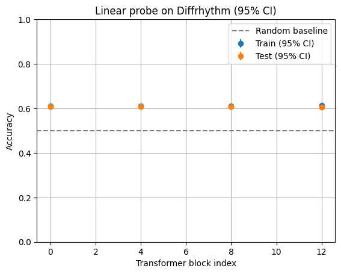
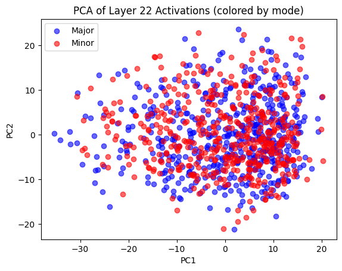
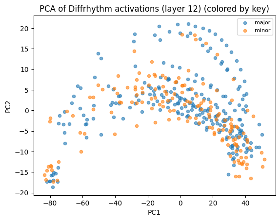
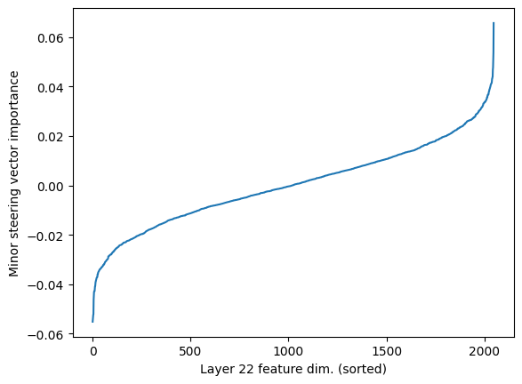

# Interpretability of Large Music Generation Models Using Linear Probes

William Feng, Harini Thiagarajan, Michelle Wei

## Introduction

Transformer-based audio models have achieved remarkable proficiency in generating coherent music from text prompts. MusicGen [Copet et al., 2023](https://arxiv.org/abs/2306.05284) produces full-bandwidth music through autoregressive token prediction, while [DiffRhythm Ning et al., 2025](https://arxiv.org/abs/2503.01183) achieves faster inference through parallel denoising of continuous latents. Yet despite their success, understanding how these models internally represent musical concepts remains poorly understood—limiting both scientific insight and practical controllability.

In NLP, interpretability has successfully mapped concepts to activation patterns [Olah et al., 2020](https://distill.pub/2020/circuits/zoom-in/). Probing reveals where linguistic properties are encoded, with many peaking at intermediate layers [Tenney et al., 2019](https://arxiv.org/abs/1905.05950). Sparse autoencoders decompose representations into interpretable features [Bricken et al., 2023](https://transformer-circuits.pub/2023/monosemantic-features). Activation steering enables training-free output control [Turner et al., 2023](https://arxiv.org/abs/2308.10248). These techniques have transformed our understanding of language models.

Analogous work on music generation remains limited in scope. [Paek et al. (2025)](https://arxiv.org/abs/2510.23802) train SAEs on audio autoencoder latents and discover pitch, amplitude, and timbre features—low-level acoustic properties. [Singh et al. (2025)](https://arxiv.org/abs/2505.18186) apply SAEs to MusicGen and find features for genre, mood, and texture, but focus on broad stylistic attributes rather than quantitative tonal analysis. [Facchiano et al. (2025)](https://arxiv.org/abs/2504.04479) demonstrate steering for tempo and brightness in MusicGen, but deliberately restrict their concept space. [Wei et al. (2025)](https://arxiv.org/abs/2410.00872) show that music-theoretic concepts are linearly decodable from MusicGen and Jukebox, providing strong evidence that models encode musical structure. However, their work is observational—it shows information is present without attempting causal manipulation or cross-architecture comparison.

We address these gaps by investigating whether major/minor mode—a fundamental tonal concept distinguishing the emotional quality of Western music—is encoded and controllable across architecturally distinct models. Unlike prior work that focuses on single architectures or observational findings, we provide the first cross-architecture comparison of tonal representations and the first causal demonstration that probe-identified mode information influences generation.

Our work makes three contributions. First, we demonstrate that mode is linearly decodable from intermediate activations of both MusicGen (62.1% at layer 21/48) and DiffRhythm (59.3% at block 12/24) with $p < 10^{-150}$. The characteristic middle-layer peak occurs at 44–50% depth in both cases despite radically different architectures—autoregressive token prediction versus parallel latent denoising. This cross-architecture consistency suggests tonal encoding is a general property of learned music representations rather than an artifact of any particular model family.

Second, we show that probe-derived steering vectors causally influence generated mode, achieving 23% flip rate while random directions of equal magnitude produce negligible effects. This bridges the gap between observational probing—which shows information is present—and practical controllability.

Third, we document that sparse autoencoders fail catastrophically in this data regime with 98% dead features, exposing fundamental limitations when transferring language interpretability methods to audio and motivating future methodological development.

## Background

### Audio Generation Architectures

MusicGen is a 48-layer decoder-only transformer over discrete EnCodec tokens [Copet et al., 2023](https://arxiv.org/abs/2306.05284). Multiple quantized streams are flattened into a single autoregressive sequence, allowing full-bandwidth generation in one pass. With hidden dimension 2048 and residual stream architecture resembling GPT-style models, MusicGen is a natural target for NLP interpretability techniques.

DiffRhythm follows a latent [Diffusion Transformer architecture](https://arxiv.org/abs/2503.01183). An audio autoencoder compresses waveforms into continuous latents, and a 24-block DiT denoises these latents in parallel. Compared to autoregressive models, DiffRhythm trades sequential generation for faster inference and potentially stronger global coherence—the model sees the entire latent at each step rather than building context incrementally.

These architectures offer complementary views: MusicGen exposes token-level hidden states through autoregressive generation, while DiffRhythm exposes holistic latents through parallel denoising. By analyzing both, we test whether interpretability findings generalize across generation paradigms.

### Interpretability Methods

Linear probes are simple classifiers trained on frozen activations to test whether concepts are linearly decodable [Alain & Bengio, 2016](https://arxiv.org/abs/1610.01644). Linear classifiers have limited capacity, so successful probing indicates genuinely accessible information. In language models, [Tenney et al. (2019)](https://arxiv.org/abs/1905.05950) show that different properties peak at different depths, revealing hierarchical processing. A limitation is that probing is correlational—high accuracy shows information is present but not that it influences outputs.

Sparse autoencoders decompose activations into interpretable feature bases by training overcomplete dictionaries with sparsity constraints [Bricken et al., 2023](https://transformer-circuits.pub/2023/monosemantic-features). In language models, SAEs recover features for entities, syntax, and behavioral modes [(Cunningham et al., 2023)](https://arxiv.org/abs/2309.08600). However, success depends on data scale—language SAEs train on billions of tokens.

Activation steering provides causal tests. By identifying concept directions in activation space and adding them during inference, we test whether representations influence outputs [(Turner et al., 2023)](https://arxiv.org/abs/2308.10248). Successful steering confirms probed information is functionally relevant.

## Methodology

### Dataset Construction

We generated 1,000 five-second solo-piano clips using MusicGen-large, conditioned on prompts describing classical and romantic styles while deliberately avoiding jazz, contemporary, or highly chromatic idioms. This homogeneous setting serves two purposes: it simplifies automatic key detection by avoiding ambiguous tonal contexts, and it isolates tonal structure from timbral and textural variation that might confound analysis.

For each clip, we stored three objects: the raw waveform at 32kHz sampling rate, activations from all 48 transformer layers captured via forward hooks during generation, and metadata including key and mode labels from `librosa`'s chromagram-based key detection algorithm.

The resulting dataset contains 528 clips labeled major and 472 labeled minor, roughly balanced across modalities. The distribution over specific keys was skewed: C minor (155 clips) and D♯ major (108 clips) were most frequent, followed by G♯ major (69), G minor (67), and A♯ major (62). Less common keys like C♯ minor (7 clips) and A major (12 clips) were underrepresented. We use 70/30 stratified splits throughout to preserve the major/minor ratio.

We acknowledge that automatic key detection introduces label noise. The `librosa` algorithm achieves approximately 70% accuracy on clean, professionally recorded music and likely performs worse on short synthetic clips with potential artifacts. Some clips are genuinely ambiguous between relative major and minor keys, which share identical pitch class content. This label noise creates a ceiling on probe accuracy—our results should be interpreted as lower bounds on the true amount of tonal information encoded.

### Activation Processing

For MusicGen, we captured hidden states $H_\ell^{(i)} \in \mathbb{R}^{T_i \times 2048}$ at each layer. For DiffRhythm, we recorded from every 4th of 24 blocks. We applied max pooling across time to obtain fixed-dimensional representations, then projected to 128 PCA dimensions (fit on training data only) to mitigate overfitting.

### Linear Probing Protocol

We trained logistic regression probes at each layer to predict binary major/minor using 70/30 stratified splits. For robustness, we repeated over 1,024 random splits and computed 95% confidence intervals via the $t$-distribution: $\text{CI}_{95} = \bar{a} \pm t_{0.975, n-1} \cdot s/\sqrt{n}$, where $\bar{a}$ is mean accuracy, $s$ is standard deviation, and $n = 1024$.

### Sparse Autoencoder Training

We trained a TopK SAE on max-pooled layer 22 activations with 8,192 features (4× expansion) and $k=64$ active features per sample, minimizing reconstruction MSE: $\mathcal{L} = \|x - \hat{x}\|_2^2$. We analyzed feature-key correlations by examining key distributions among top-activating clips.

### Activation Steering Protocol

From probe weights $W \in \mathbb{R}^{2 \times 128}$ (major=row 0, minor=row 1), we extracted $w_\text{minor}^\text{PCA} = W[1,:] - W[0,:]$ and projected through PCA: $v_\text{minor} = P_{128} \cdot w_\text{minor}^\text{PCA} \in \mathbb{R}^{2048}$. During generation, we modified layer 22 activations: $H_{22}'[t,:] = H_{22}[t,:] + \alpha \cdot v_\text{minor}$ for steering strength $\alpha \in [-20, 20]$.

Control experiments replaced $v_\text{minor}$ with random unit vectors and applied steering at non-optimal layers (5 and 45) to verify specificity.

## Results

### Layer-wise Probing

MusicGen accuracy rose from near-chance in early layers (layer 0: 56.3%) to peak at layer 21 with 62.1% ± 0.5% test accuracy, then declined toward output (layer 47: 57.2%). DiffRhythm showed identical patterns, peaking at block 12 with 59.3% ± 0.6%.

*Figure 1: DiffRhythm layer-wise accuracy shows the characteristic middle-layer bump observed in NLP interpretability.*

The statistical significance is overwhelming. Computing $t = (\bar{a} - 0.5)/(s/\sqrt{n})$ against 50% chance yields $t \approx 75.2$ for MusicGen and $t \approx 48.1$ for DiffRhythm, corresponding to $p < 10^{-150}$. These are not sampling artifacts.

| Property | MusicGen | DiffRhythm |
|----------|----------|------------|
| Architecture | Autoregressive transformer | Diffusion transformer |
| Peak accuracy | 62.1% ± 0.5% | 59.3% ± 0.6% |
| Peak layer (absolute) | 21/48 | 12/24 |
| Peak layer (relative) | 44% | 50% |
| $t$-statistic | 75.2 | 48.1 |

*Table 1: Cross-architecture comparison reveals similar tonal encoding despite different generation mechanisms.*

PCA visualization of peak-layer activations shows partial but incomplete separation between major and minor, consistent with above-chance but imperfect accuracy.

*Figure 2: Partial separation explains the 62% accuracy ceiling—substantial overlap prevents perfect classification.*

*Figure 3: Similar PCA structure across architectures supports cross-architecture consistency.*

### Sparse Autoencoder Analysis

The SAE achieved 0.0188 reconstruction MSE with 99.22% sparsity. However, 8,061 of 8,192 features (98.4%) remained dead—never activated on any input. For surviving features, we examined key distributions among top-20 activating clips. No feature showed significant mode correlation; distributions matched the global dataset.

| Metric | Value |
|--------|-------|
| Dictionary size | 8,192 |
| Dead features | 8,061 (98.4%) |
| Reconstruction MSE | 0.0188 |

*Table 2: SAE statistics reveal catastrophic underutilization of dictionary capacity.*

This failure reflects data regime mismatch. Language SAEs train on billions of diverse tokens; our SAE saw 344 usable clips from a narrow piano distribution. The 8,192-feature dictionary was overparameterized by ~20×, and homogeneous inputs provided insufficient diversity.

### Activation Steering

At $\alpha = 15$, 23% of originally-major clips were detected as minor. Key confidence dropped from 0.31 (baseline) to 0.24 (steered), indicating some tonal degradation but not collapse. For $|\alpha| > 15$, artifacts increased substantially.

Controls confirmed specificity. Random unit vectors produced < 2% flip rate across all $\alpha$. Steering at layer 5 or 45 produced < 5% flip rate, far less than the 23% at layer 22. This rules out generic perturbation artifacts.

*Figure 4: Non-uniform weights indicate mode information is concentrated in specific dimensions.*

**Audio Examples:** Steering effects across different $\alpha$ values. Each clip shows the progression from major-biased (α=-15) through baseline (α=0) to minor-biased (α=+15).

Clip 0034

<table class="w-full my-2">
<tr><td class="py-1">alpha = -15 (toward major)</td><td><audio controls class="w-full max-w-sm"><source src="./steering_experiments/clip_0034/alpha_-15.wav" type="audio/wav"></audio></td></tr>
<tr><td class="py-1">alpha = -02</td><td><audio controls class="w-full max-w-sm"><source src="./steering_experiments/clip_0034/alpha_-02.wav" type="audio/wav"></audio></td></tr>
<tr><td class="py-1">alpha = +00 (baseline)</td><td><audio controls class="w-full max-w-sm"><source src="./steering_experiments/clip_0034/alpha_+00.wav" type="audio/wav"></audio></td></tr>
<tr><td class="py-1">alpha = +02</td><td><audio controls class="w-full max-w-sm"><source src="./steering_experiments/clip_0034/alpha_+02.wav" type="audio/wav"></audio></td></tr>
<tr><td class="py-1">alpha = +15 (toward minor)</td><td><audio controls class="w-full max-w-sm"><source src="./steering_experiments/clip_0034/alpha_+15.wav" type="audio/wav"></audio></td></tr>
</table>

Clip 0130

<table class="w-full my-2">
<tr><td class="py-1">alpha = -15 (toward major)</td><td><audio controls class="w-full max-w-sm"><source src="./steering_experiments/clip_0130/alpha_-15.wav" type="audio/wav"></audio></td></tr>
<tr><td class="py-1">alpha = -02</td><td><audio controls class="w-full max-w-sm"><source src="./steering_experiments/clip_0130/alpha_-02.wav" type="audio/wav"></audio></td></tr>
<tr><td class="py-1">alpha = +00 (baseline)</td><td><audio controls class="w-full max-w-sm"><source src="./steering_experiments/clip_0130/alpha_+00.wav" type="audio/wav"></audio></td></tr>
<tr><td class="py-1">alpha = +02</td><td><audio controls class="w-full max-w-sm"><source src="./steering_experiments/clip_0130/alpha_+02.wav" type="audio/wav"></audio></td></tr>
<tr><td class="py-1">alpha = +15 (toward minor)</td><td><audio controls class="w-full max-w-sm"><source src="./steering_experiments/clip_0130/alpha_+15.wav" type="audio/wav"></audio></td></tr>
</table>

Clip 0925

<table class="w-full my-2">
<tr><td class="py-1">alpha = -15 (toward major)</td><td><audio controls class="w-full max-w-sm"><source src="./steering_experiments/clip_0925/alpha_-15.wav" type="audio/wav"></audio></td></tr>
<tr><td class="py-1">alpha = -02</td><td><audio controls class="w-full max-w-sm"><source src="./steering_experiments/clip_0925/alpha_-02.wav" type="audio/wav"></audio></td></tr>
<tr><td class="py-1">alpha = +00 (baseline)</td><td><audio controls class="w-full max-w-sm"><source src="./steering_experiments/clip_0925/alpha_+00.wav" type="audio/wav"></audio></td></tr>
<tr><td class="py-1">alpha = +02</td><td><audio controls class="w-full max-w-sm"><source src="./steering_experiments/clip_0925/alpha_+02.wav" type="audio/wav"></audio></td></tr>
<tr><td class="py-1">alpha = +15 (toward minor)</td><td><audio controls class="w-full max-w-sm"><source src="./steering_experiments/clip_0925/alpha_+15.wav" type="audio/wav"></audio></td></tr>
</table>

## Discussion

The central finding is that tonal encoding is architecturally invariant. Despite different generation mechanisms—autoregressive token prediction versus parallel latent denoising—both models exhibit the same pattern: mode peaks at 44–50% depth and declines toward output. This convergence suggests distinguishing major from minor is useful for predicting musical continuations regardless of generation paradigm, consistent with the hypothesis that models learn functionally relevant representations.

Peak accuracies of 62% and 59% may seem modest, but context matters. Our labels come from `librosa` (~70% accurate), creating a supervision ceiling. Some clips are genuinely ambiguous between relative major/minor. And mode may be partially nonlinear. The extreme statistical significance ($p < 10^{-150}$) is the key metric—with 1,024 bootstrap samples and tight CIs, we definitively reject the null hypothesis. The modest accuracy reflects ceiling effects, not absence of signal.

The layer-wise "bump" mirrors NLP findings [(Tenney et al., 2019)](https://arxiv.org/abs/1905.05950). Early layers process local features; middle layers form abstract concepts including key and mode; late layers prepare output format. This identifies middle layers as optimal intervention targets for controllable generation.

The 98% dead feature rate establishes that language SAE methods cannot be naively transferred to audio. Our 344 clips versus 8,192 features represents ~20× overparameterization. Future audio SAEs require either much larger datasets (10,000+ diverse clips) or architectures designed for small-data regimes.

The 23% flip rate confirms probe representations causally influence generation—random directions and non-optimal layers produce no effect. However, informal listening revealed steering also affects timbre and dynamics. The "mode direction" bundles correlated attributes that co-occur in Western music. Single-direction steering provides coarse "mood" control rather than precise tonal manipulation.

These findings have practical implications for controllable music generation. The existence of linearly decodable tonal representations suggests that lightweight, training-free control is feasible. Rather than fine-tuning models on curated datasets or engineering complex conditioning mechanisms, simple activation steering may provide a path to coarse stylistic control with minimal computational overhead. For creative applications, this could enable rapid prototyping of controllable interfaces—a "mood slider" that adjusts brightness or darkness without retraining.

The cross-architecture consistency has broader implications. If tonal representations emerge similarly across MusicGen and DiffRhythm despite different architectures and training objectives, interpretability tools may transfer across the diverse ecosystem of music generation models. Analysis pipelines developed for one model could apply to new releases, reducing the effort required to understand and control each new system.

More broadly, our results demonstrate that music generation models learn structured representations supporting inspection and intervention. These are not simply black boxes producing pleasant audio—they contain organized internal states encoding musically meaningful concepts that can be read out and modified. As generative tools become prevalent in production workflows, this understanding is crucial for building systems that are not only capable but predictable and aligned with human intentions.

## Limitations

Several limitations qualify our conclusions and suggest directions for future work.

The most significant limitation concerns label quality. All key and mode labels derive from `librosa`'s automatic detection, which achieves ~70% accuracy on clean recordings and likely performs worse on short synthetic clips. The algorithm exhibits biases toward common keys and struggles with relative major/minor pairs. This label noise creates a ceiling on probe accuracy and may introduce systematic errors in layer-wise comparisons. The true amount of tonal information in these models is almost certainly higher than what we measure.

The dataset limits generalization. We focus on 5-second solo-piano clips from classical/romantic prompts—a deliberately homogeneous setting that simplifies analysis but restricts external validity. Whether findings extend to longer compositions, multi-instrument arrangements, non-Western tonalities, or atonal music remains untested. The SAE experiments suffer particularly from limited diversity.

Our temporal pooling discards fine-grained structure. By max-pooling across time, we lose information about how tonal encoding evolves—whether key is established early and maintained, or emerges gradually. Per-token probing would reveal temporal dynamics.

Steering evaluation relies on automatic detection rather than human listening studies. The 23% flip rate measures changes in `librosa` output; human perception may differ. Formal studies with musically trained participants would strengthen claims about perceptual impact.

The steering direction is entangled with correlated attributes—we cannot cleanly isolate mode from timbre, dynamics, or harmonic complexity. This entanglement may be intrinsic to how music works, but limits control precision.

Finally, we study only two models. Additional architectures would strengthen generalization claims.

## Future Work

Human-annotated labels for a subset of clips would establish cleaner ground truth and sharper accuracy estimates. Formal listening studies could quantify perceptual steering impact.

Scaling SAE training to 10,000+ diverse clips spanning multiple instruments and genres may enable feature discovery. Alternatively, architectures designed for small-data regimes—gated SAEs, β-VAEs—may work with current data.

Per-token or per-frame probing could reveal temporal dynamics: when is key established, how is it maintained? Attention analysis might identify heads specializing in tonal processing.

Multi-task probing—simultaneously predicting mode, tempo, timbre—could identify orthogonal concept directions for disentangled control. Concept bottleneck approaches might enable independent manipulation.

Cross-model transfer experiments would test whether steering vectors from MusicGen work in DiffRhythm or future models. Successful transfer would suggest shared tonal representations across the field.

## Conclusion

We investigated whether text-to-music models encode major/minor mode and whether this encoding supports controllable generation. Our experiments provide affirmative answers while revealing important limitations.

The probing results establish that mode is linearly decodable from intermediate activations of both MusicGen (62.1% at layer 21/48) and DiffRhythm (59.3% at block 12/24), with statistical significance exceeding $p < 10^{-150}$ across 1,024 bootstrap samples. The characteristic middle-layer peak occurs at remarkably similar relative depths—44% for MusicGen and 50% for DiffRhythm—despite radically different architectures. Autoregressive token prediction and parallel latent denoising converge on similar internal organizations of tonal information, suggesting that distinguishing major from minor is functionally useful for musical prediction regardless of the specific generation mechanism.

The steering experiments confirm causal influence. Adding probe-derived directions to layer 22 activations shifts detected mode with 23% flip rate, while random directions produce negligible effects and non-optimal layers produce weak effects. This specificity establishes that the identified direction genuinely encodes mode-relevant information used during generation.

The SAE analysis yields a valuable negative result. With 98% dead features and no tonal specificity among survivors, we demonstrate that sparse autoencoder methods cannot be naively transferred from language to audio. Language SAEs train on billions of tokens; our 344-clip dataset was insufficient for an 8,192-feature dictionary. This motivates future work on interpretability methods adapted to audio data regimes.

Taken together, these findings demonstrate that standard interpretability tools—probes and steering—provide meaningful traction on music generation systems. The cross-architecture consistency suggests analysis techniques may transfer across the diverse landscape of current and future models. As music generation becomes increasingly prevalent in creative workflows, understanding internal representations is essential for building systems that are not only capable but controllable, transparent, and aligned with human musical intentions.

